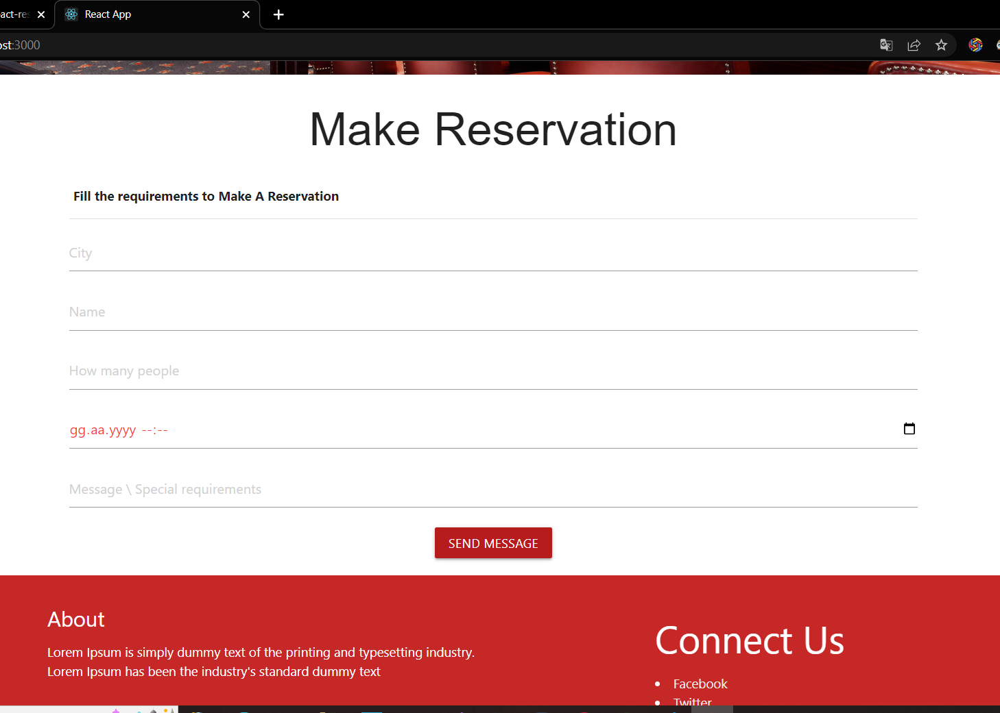

# Delicioso Restaurant

Welcome to the Delicioso, This is the Landing Page. You can get an introduction and view the restaurant menu here

## Available Scripts

In order to start the project,  
1- Install the node_modules `npm i`
 
2- Start the server `npm run start`
## Tools Used
1- React.js For building the UI. React Router have been used for routing.  
2-  Materialize css -- For Styling and CSS Adjustments
## Screenshots
</img>
</img>
</img>
</img>
</img>
</img>
